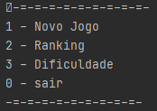
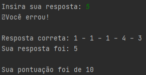
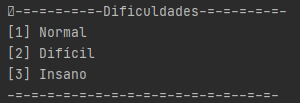
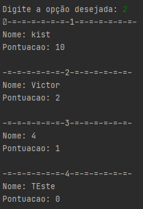

<h1 align="center">
    </li>
    </li>
    GENIUS
    </li>
    </li>
</h1>
<h2>Projeto</h2>

Menu 

Caso o usuário erre a resposta, é mostrado a sequência correta e o erro do jogador

É possível também escolher a dificuldade, o que reflete na pontuação do jogador

Um ranking dos 5 melhores jogadores é criado

